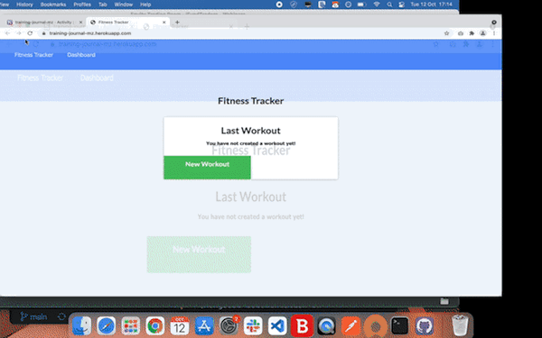

# Training Journal

I have created a workout tracker - integrating a Mongo database with a Mongoose schema and handling routes with express. My task was to build the backend functionality to bring the existing frontend code to life. It was deployed with Heroku and MongoDB Atlas, and can also be run locally.

## User Story

- As a user, I want to be able to view create and track daily workouts. I want to be able to log multiple exercises in a workout on a given day. I should also be able to track the name, type, weight, sets, reps, and duration of exercise. If the exercise is a cardio exercise, I should be able to track my distance traveled.

## Business Context

A consumer will reach their fitness goals more quickly when they track their workout progress.

## Instructions

To use the app locally:

1. Download or clone this repository and open in your IDE.
2. Install mongodb and start up a server - [follow these instructions according to your device](https://coding-boot-camp.github.io/full-stack/mongodb/how-to-install-mongodb)
3. Run `npm i` to set up dependencies and `npm start` to view on `localhost:3000`.

## Functionality

When the user loads the page, they should be given the option to create a new workout or continue with their last workout.

The user should be able to:

- Add exercises to the most recent workout plan.

- Add new exercises to a new workout plan.

- View the combined weight of multiple exercises from the past seven workouts on the `stats` page.

- View the total duration of each workout from the past seven workouts on the `stats` page.

## Live URL

https://training-journal-mz.herokuapp.com/

## Credits

[MongoDB documentation on the $addFields](https://docs.mongodb.com/manual/reference/operator/aggregation/addFields/)  
 [MongoDB documentation on the $sum operator](https://docs.mongodb.com/manual/reference/operator/aggregation/sum/)  
 [Mongoose documentation on aggregate functions](https://mongoosejs.com/docs/api.html#aggregate_Aggregate)

## Demo

## Screenshots

